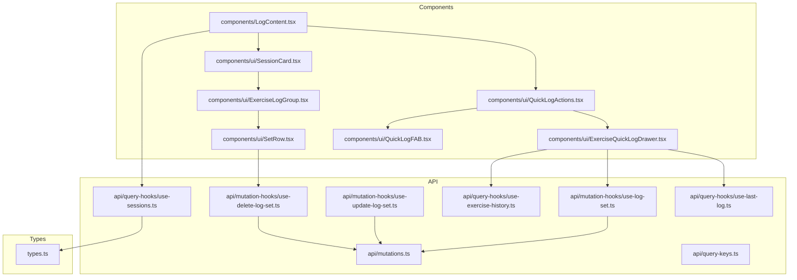

# Logging Feature Code Dependency Graph

## Component/Function Descriptions

### types.ts
- `SessionExerciseLogWithRelations`: Represents a simplified session exercise log.
- `SessionWithLogs`: Metadata and logs for a single workout session.
- `GroupedSession`: Collections of sessions grouped by time labels.
- `PaginatedResponse<T>`: Generic API pagination wrapper.

### api/
- **mutations.ts**: Core `fetch` logic for POST/DELETE/PATCH operations on logs.
- **query-keys.ts**: Factory for React Query keys ensuring cache consistency.
- **mutation-hooks/**: `useLogSet`, `useDeleteLogSet`, `useUpdateLogSet` provide high-level React Query mutations with optimistic updates.
- **query-hooks/**: `useInfiniteSessions` and `useLastLog` provide data fetching with support for pagination.

### components/
- `LogContent`: The feature's entry point. Orchestrates the dashboard stats, timeline rendering, and quick log interactivity.
- `ui/SessionCard`: Visual summary of a workout session, including volume and muscle group targets.
- `ui/ExerciseLogGroup`: Organizes individual sets under an exercise header; links to full exercise history.
- `ui/SetRow`: Detail row for a single logged set; handles set removal.
- `ui/QuickLogActions`: Coordinator for the floating "Quick Log" action flow.
- `ui/QuickLogFAB`: Floating visual trigger for starting a manual log entry.
- `ui/ExerciseQuickLogDrawer`: Shared exercise detail drawer that combines quick logging with full history.
