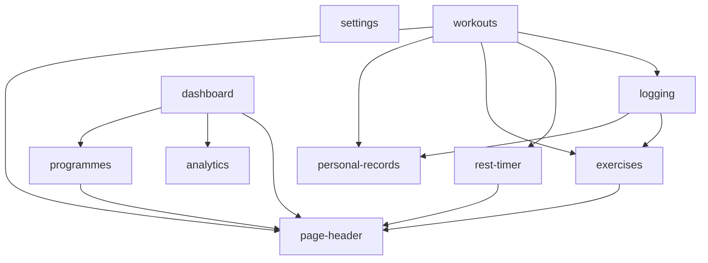

# Product Requirements Document (PRD): React Native Migration

## Problem Statement

The current Workout Tracker client is a React 19 web application (`react-client`). While it uses a mobile-first design and supports PWA capabilities, workout tracking is inherently a native mobile experience. Web browsers on mobile OSs regularly prune background memory, which suspends the rest timer, clears in-flight workout logs on page reload, and prevents true offline functionality. Furthermore, cookie-based authentication is difficult and unreliable to manage natively in iOS and Android.

## Solution

Migrate the client codebase to a native mobile application located in a new workspace folder, `react-native-client`, leaving the original `react-client` untouched as a backup. The app will be built using Expo Managed Workflow, Expo Router (file-system navigation), NativeWind v4 (Tailwind parity), MMKV (fast synchronous persistence), and Moti (animations). The NestJS backend will support a hybrid JWT Bearer auth header in addition to standard cookies. 

This migration will be completed in phases, beginning with basic app/auth setup, followed by a bottom-up, module-by-module import of features based on their dependency graph.

## User Stories

1. As a workout tracker user, I want the app to open instantly on my phone, so that I can begin my workout without waiting for browser tabs to reload.
2. As a user, I want my active workout session to persist even if the app goes to the background or the OS suspends it, so that I never lose my active sets.
3. As a user, I want to receive haptic and sound notifications for the rest timer even when my screen is locked, so that I know exactly when to start the next set.
4. As a user, I want to see my training volume, muscle distribution, and fatigue trends rendered in smooth native charts, so that I can track my fitness progress easily.
5. As a user, I want to log my workouts completely offline (e.g. in basements or gym dead zones), so that my data is queued and syncs automatically when I reconnect to the internet.
6. As a developer, I want the native client folder structure to match the web client, so that I can easily find and map feature logic.

## Implementation Decisions

### Phase 1: Core Setup & Shared Infrastructure
*   **Target Folder:** Create `/react-native-client` parallel to `/react-client`.
*   **Infrastructure:** Set up Expo SDK, Expo Router, NativeWind, MMKV (TanStack Query cache persister), and `expo-secure-store` (for JWT credentials).
*   **Backend Auth Guard Upgrade:** Modify the NestJS `BackendAuthGuard` to support `Authorization: Bearer <token>` extraction in addition to browser cookies. Return the signed JWT in login/signup JSON payloads.

### Phase 2: Leaf Modules (No External Dependencies)
*   **`page-header`:** Coordinates top navigation headers, actions, and page-level statuses.
*   **`personal-records`:** PR calculation helpers and the `<PRCelebrationOverlay>` UI.
*   **`settings`:** User profiles, feedback submissions, and system theme toggles.
*   **`analytics`:** Basic offline training heatmap data mapping.

### Phase 3: Intermediate Feature Modules
*   **`rest-timer`:** Native timer hook, floating bubble component, and local notifications. *Depends on: `page-header`.*
*   **`exercises`:** Custom exercise creator, muscle group selector, and `<ExerciseSelectDrawer>`. *Depends on: `page-header`.*

### Phase 4: Data Logging Modules
*   **`logging`:** Log set mutation hooks (`useLogSet`, `useUpdateLogSet`, `useDeleteLogSet`), history list, and `<ExerciseQuickLogDrawer>`. *Depends on: `exercises`, `personal-records`.*

### Phase 5: Routing & Session Coordinators
*   **`programmes`:** Programme list screen, routine creation. *Depends on: `page-header`.*
*   **`workouts`:** Active workout tracking screens, active timer bridge, `<ExerciseCard>` coordinates. *Depends on: `logging`, `rest-timer`, `personal-records`, `exercises`, `page-header`.*

### Phase 6: Analytics & Dashboard Visualizations
*   **`dashboard`:** Main screen layout containing training charts. *Depends on: `page-header`, `analytics`, `programmes`.*
*   **`victory-native` charts:** Implementation of GPU-accelerated Line, Bar, and Pie components to replace `recharts`.

---

### Module Dependency Matrix

## Testing Decisions

*   **Testing Seams:** The primary seam is the UI component rendering layer. We will test external visual states and button triggers instead of internal state lifecycles.
*   **Tools:** Standardize on `@testing-library/react-native` and `vitest` for the mobile client.
*   **Prior Art:** Use `react-client/src/app/__tests__/NotFound.test.tsx` as the testing structure reference, adapting DOM selectors to native React Native components.

## Out of Scope
*   Web version enhancements: No changes will be introduced to `react-client`.
*   Relational Local Databases: No local SQLite/Realm database will be introduced; local persistence remains owned by TanStack Query + MMKV.

## Further Notes
*   **Haptic Feedback:** Native workout completion triggers should use `expo-haptics`.
*   **Fonts:** Outfit and Plus Jakarta Sans display fonts should be preloaded during the Expo SplashScreen phase.
